# Copper Rim Cap for a Drinking Horn: Etching, Electroplating and a 50/50 Acetone Secret

*A father and son metalwork project — copper sheet, toner transfer etching, and one tip that will save you days of frustration.*

---

My son is at university and his club has a drinking horn that's been in use for a couple of decades. It has a leather carrying strap attached to a couple of rings that we suspect are nickel-plated copper or brass. The two bands look like cast metal — the mould was some kind of Celtic or Viking knotwork pattern. Have a look at the photos and decide for yourself.

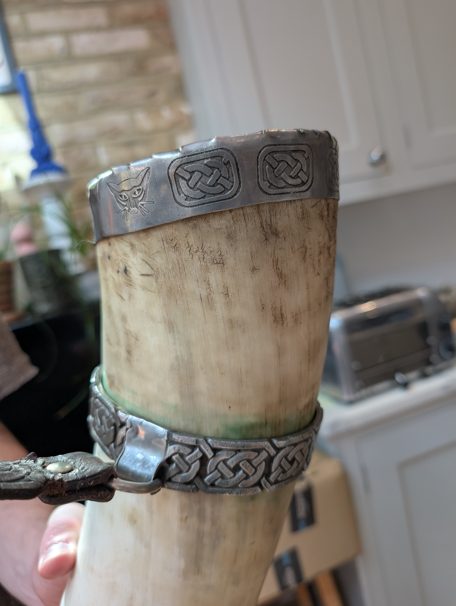

But the rim of the horn was becoming damaged and delaminating due to blows and general wear and tear. One option was to cut a few cm back to fresh material — but that road goes nowhere, and the new rim would just suffer the same fate. So we decided to take on a little metalwork and electroplating project.

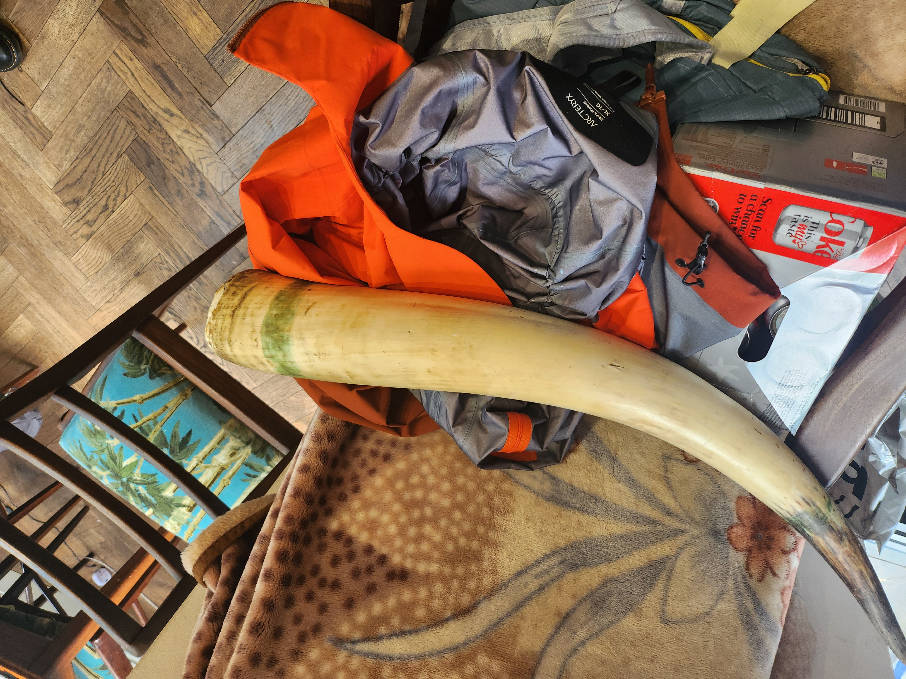

---

## Step One: Stabilise the Rim

Before doing anything else we injected epoxy between the delaminating layers of horn material, wrapped the rim in cling film, and clamped it between some curved blocks until cured. Once the rim was solid again we made a cardboard template of the inside and outside of the rim, about 2.5cm wide.

---

## The Plan

The idea was to transfer the template to two strips of 0.8mm copper sheet and solder the ends of each strip together into two rings — I believe the term is *elliptic bezel*. One strip would be wide enough to cut a series of fold-over tabs along one edge; folding those tabs over the rim of the horn would pull the inner and outer rings into contact, and then we'd solder the tabs to join the two rings into a single cap.

First problem: raw copper sheet is work-hardened from the rolling process. It was stiff, springy, difficult to cut and almost impossible to form neatly. We needed to anneal it.

---

## Annealing

Annealing is straightforward — heat the copper to red hot with a gas blow torch, then let it cool slowly. After that, the copper was beautifully pliable and a pleasure to work. We should have done this before we cut anything; it makes tin-snip cutting dramatically easier too.

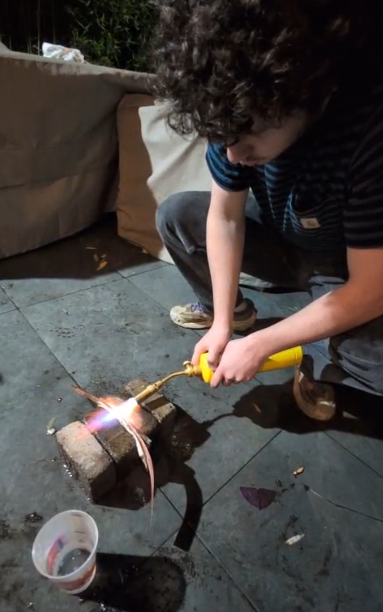

---

## Deciding to Etch a Pattern

Once we knew we could work the copper, we wanted to etch a pattern into the rim cap to match the existing carrying rings. So we tried several approaches to getting a resist layer onto the copper.

**Photoresist film and UV light** — total failure. We wasted nearly two days trying to get the exposure right and figure out a suitable mask. There are much better methods; don't go down this route.

---

## The Toner Transfer Nightmare

The approach we kept reading about was to print the design onto paper with a laser printer, then transfer the toner onto the copper as an etch resist. We bought a cheap Brother laser printer for about £50.

**Iron-on transfer** — print the design, place face-down on copper, iron the back to release the toner. Did not work at all for us, though it apparently works for others. Complete fail.

**Pure acetone transfer** — print the design, place face-down on cleaned copper, wet with pure acetone and rub until the toner releases. We failed time and time again with every paper type we tried — glossy, cheap A4, magazine covers. The toner just wouldn't release cleanly.

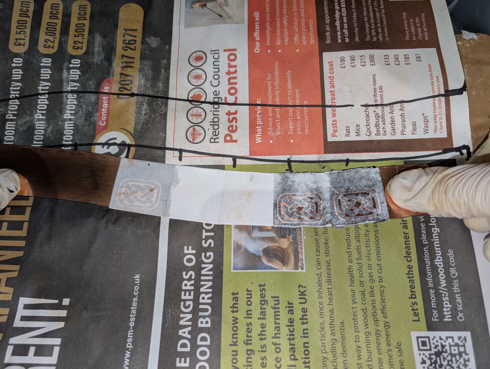

We almost gave up. We were running on no sleep after several very late nights and it had been a pretty horrible time.

---

## The Magic Trick: 50/50 Acetone and Water

Then I came across a comment in a video online. Someone mentioned that pure acetone didn't work for them either — but a cheap nail varnish remover had. What was different? It was diluted with water.

We tried mixing our acetone 50/50 with water. After days of failure, it just started working. It really was like magic.

**The method:** print your design onto cheap A4 paper (thin magazine pages would probably give an even cleaner result — smoother surface, better release). Place face-down on the copper, wet with the 50/50 solution and rub gently until the acetone evaporates. Then take it to the sink and rub under running water until the paper rolls off, leaving the toner bonded to the copper.

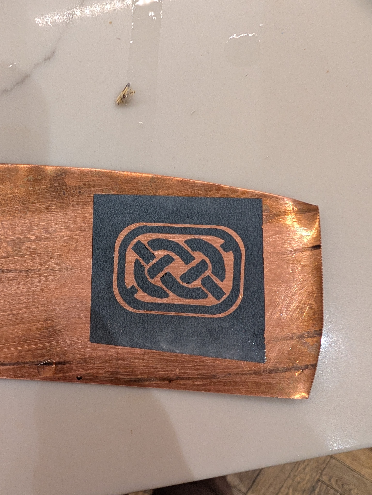

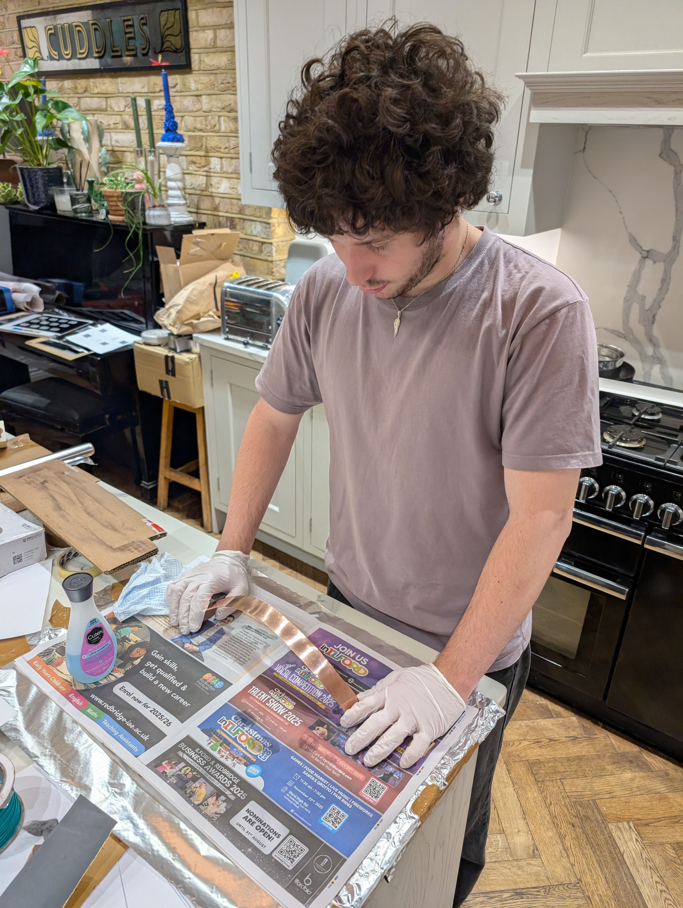

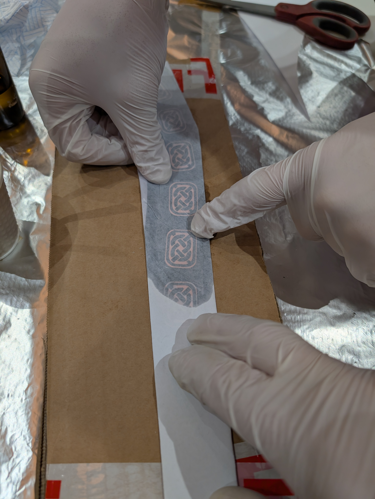

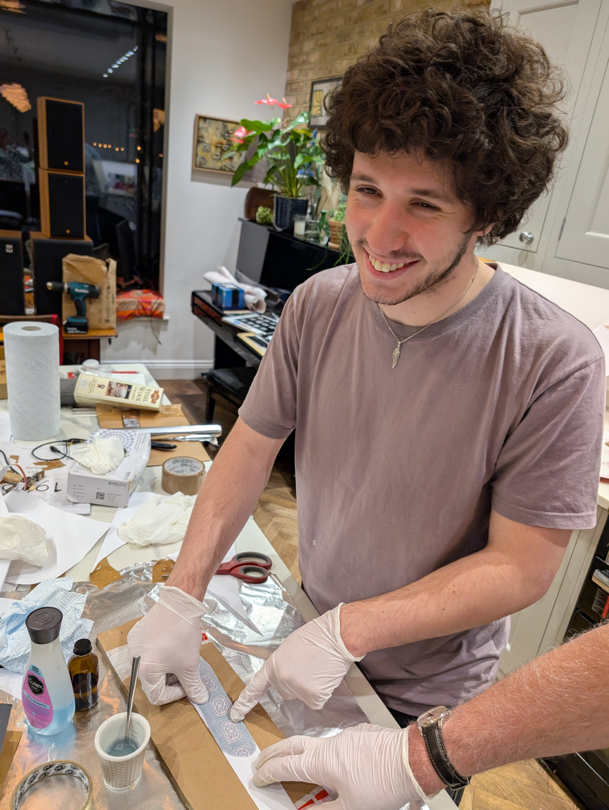

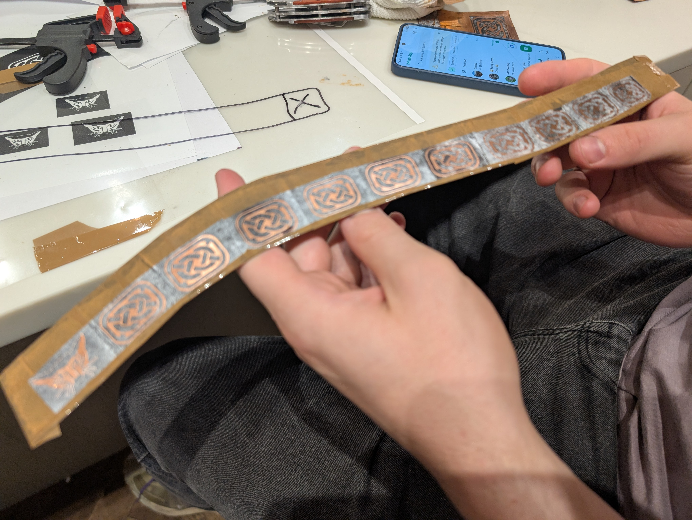

**Why it works:** the acetone softens the toner slightly so it grips the clean copper. The water swells the paper fibres and breaks their bond with the toner — so when you rub the paper off under water it releases cleanly without pulling the pattern with it. Pure acetone gives you the first part but not the second. That's the whole trick.

We used Superdrug own-brand nail varnish remover as our acetone source — relatively pure, without extra oils that might interfere. Mix it 50/50 with water and keep a small bottle ready.

We designed the final artwork on a laptop and printed it in strips on the Brother laser printer — knotwork bands to match the existing horn rings, plus a cat/fox face motif of our own to match the motif of his club at university.

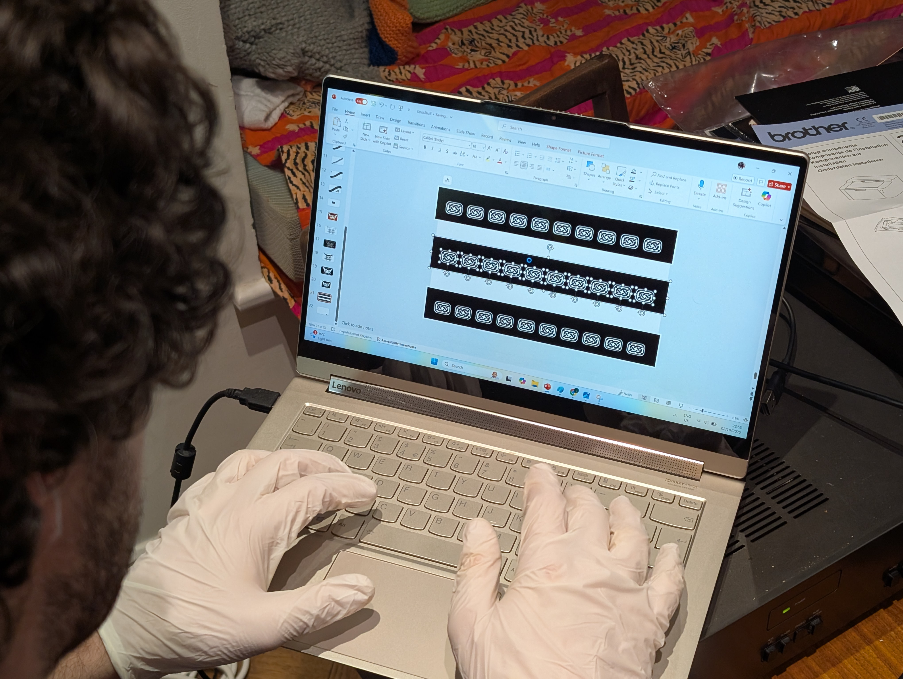

---

## Preparing the Copper

Annealing leaves a black copper oxide layer that prevents the toner from bonding — you need clean, bright copper for the transfer. We found that wet-and-dry sanding with 600-grit paper removed most of the oxide, followed by 000 steel wool to finish, then a wipe with IPA or acetone. Gloves from this point on to keep oils off the surface.

We kept prepared strips soaking in dilute acetic acid (white vinegar works, or stronger solutions from Screwfix used for driveway cleaning). The acid cleans up any remaining oxide and keeps the surface ready until you need it.

After the toner transfer was done, we touched up any gaps or pinholes in the resist layer with nail varnish — using the bottle brush to paint over any exposed copper we didn't want the acid to touch.

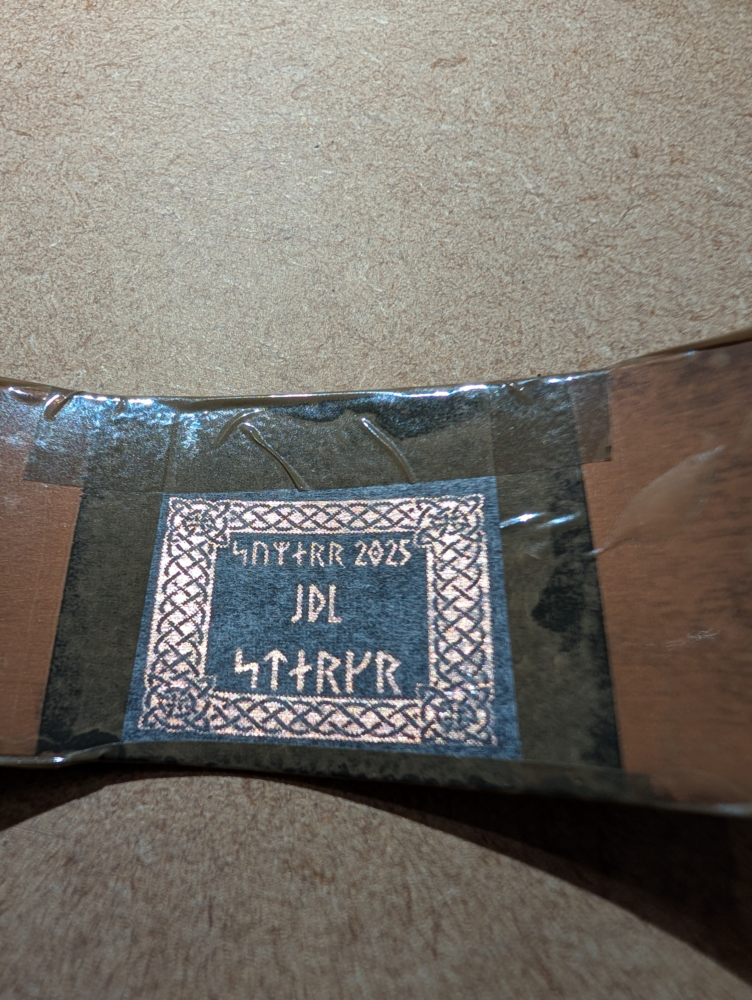

---

## Etching

We used ferric chloride. I was familiar with it from etching PCBs as a kid.

**This stuff is horrible.** If it gets onto the ceramic of your Belfast sink it will stain it and it is a giant pain to clean up. Even the iron and copper compounds that accumulate in used ferric chloride will stain ceramic a rust colour. **Please do this whole step outside, in daylight, far from anything you care about damaging.** Don't carry an etched piece or any equipment back into the house until everything has been neutralised and rinsed outside. Neutralise waste with soda crystals (washing soda, sodium carbonate), then double-bag it for the bin.

We etched in a small pink food-storage box inside a larger white tray as a spill catcher. We kept a big bag of washing soda on hand at all times.

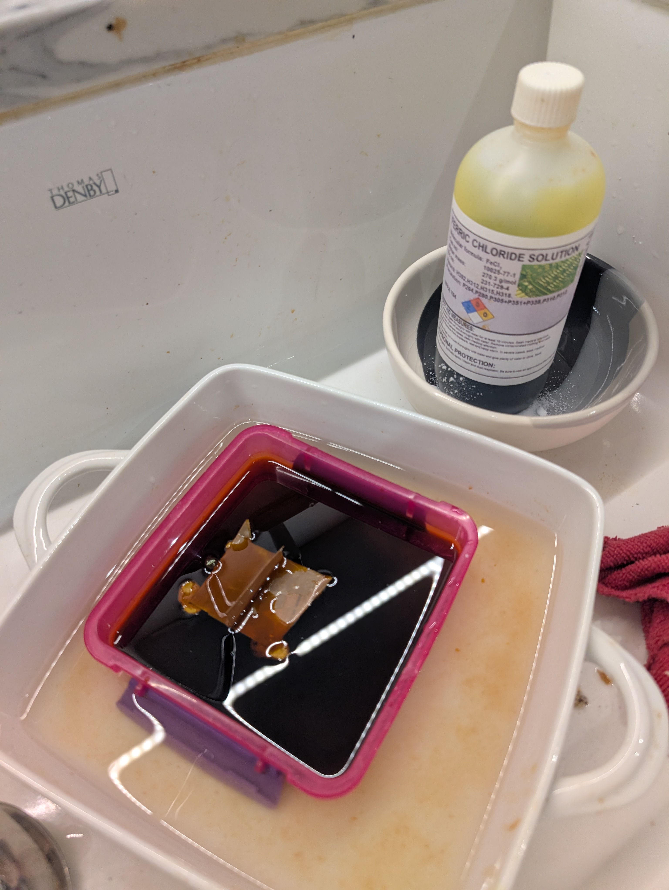

Once etching was complete we removed the remaining resist with acetone and steel wool.

---

## Forming the Cap

We used a small cast-iron anvil (£30 from eBay) and a ball-peen hammer to work each strip into a ring shape, then brought the ends together with an overlap, held tight with mole grips, and soldered them with a gas blow torch, plumber's flux, and lead-free plumber's solder. If the surfaces are prepped and close enough the solder wicks into the joint nicely.

**Tip:** the gas torch creates a lot of oxide on the copper, which means more cleaning. Later in the project we switched to an electric heat gun with a heat-reflector attachment for all the soldering stages. It takes a little longer to reach temperature but creates almost no oxide and gives much better control. Use the torch only for annealing — where the high heat is critical — and the heat gun for everything else.

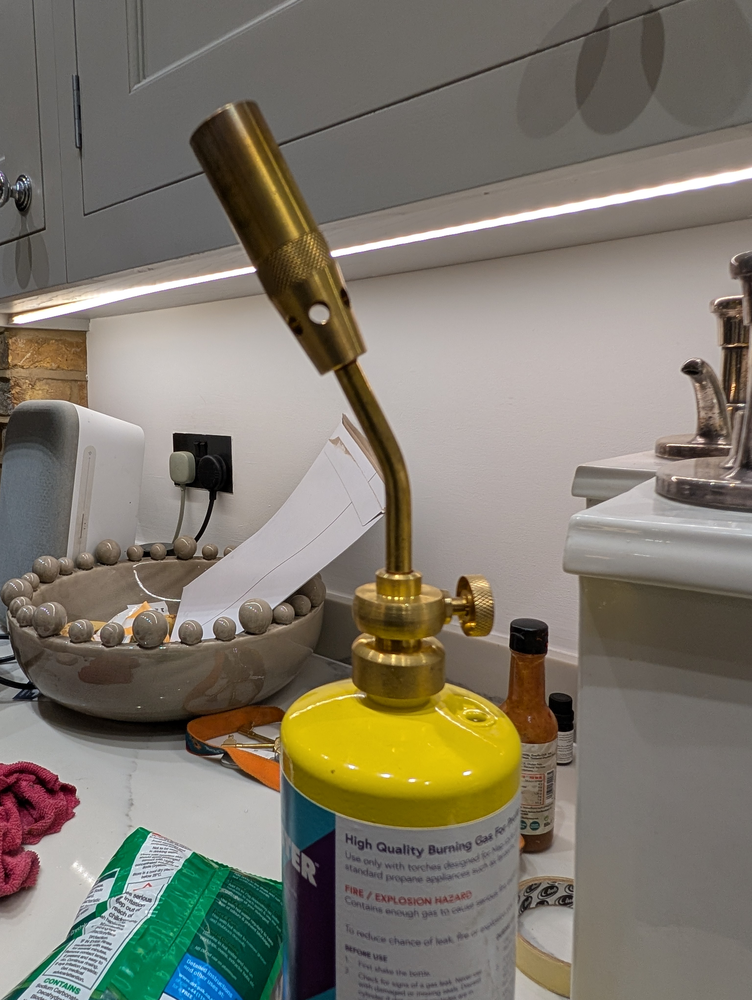

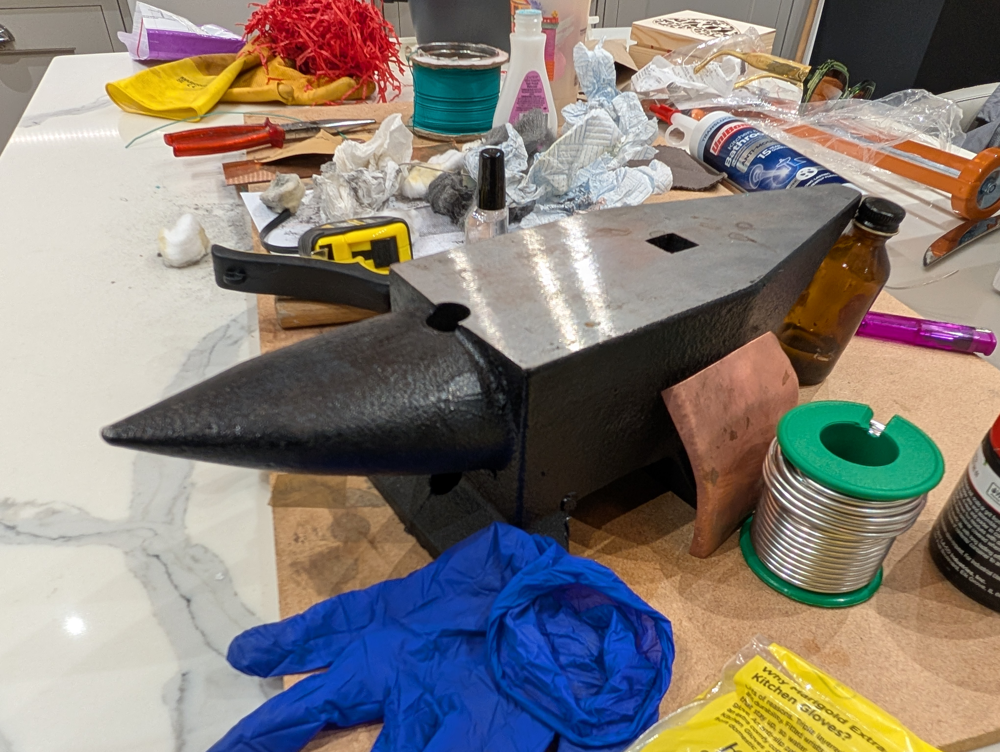

Once both strips were soldered into rings, we used the anvil and hammer to fold each tab so that when the two rings sat in their correct positions on the inside and outside of the horn rim, every tab landed cleanly and consistently on the inner ring. Getting one tab right would push another out of alignment. It took literally hours.

Once happy with the fit we taped the two rings together in position, lifted the assembly off the horn, then replaced the tape with steel wire to hold alignment during soldering. With the cap inverted we dropped small pieces of solder into the slot all the way around, applied flux with a brush, then used the heat gun to flow each section in turn. Once the first section was locked in place the rest was easy.

After soldering we filed all the tab edges smooth with miniature files. This is a drinking horn — nothing can be sharp, and the solder was lead-free.

---

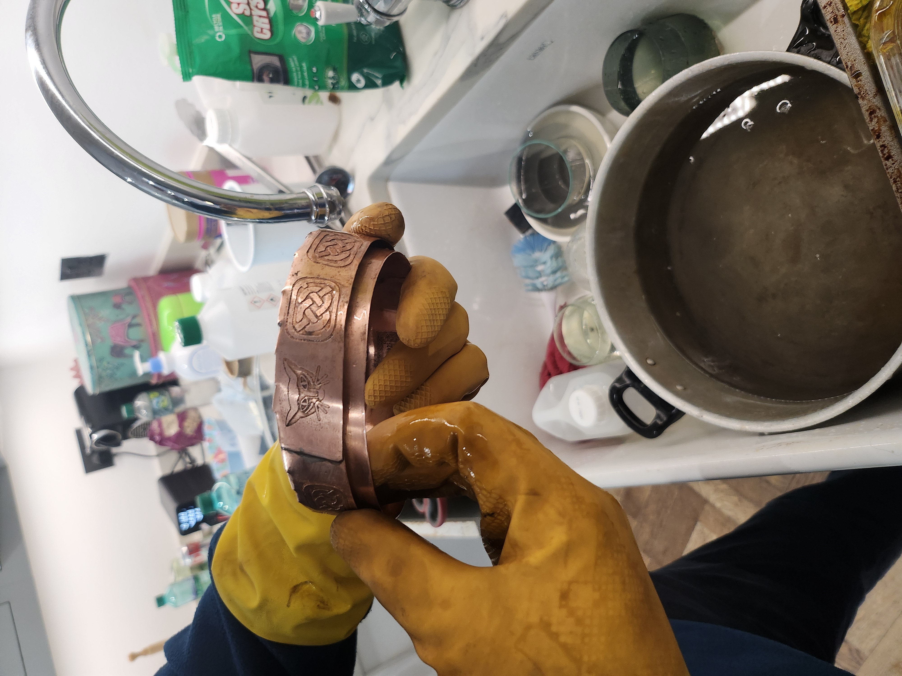

## Silver Plating: The Part That Didn't Work

We made up a silver plating solution (silver nitrate and acetic acid), connected silver electrodes to our bench power supply, and spent an evening cycling through experiments on scrap copper.

The internet is full of warnings that DIY electroplating onto copper with silver nitrate produces a thin, porous layer that you can't polish without stripping it. Those warnings are accurate. We did manage to get something silver-grey onto the copper, but it had a faint battery taste when put to your mouth. That's not acceptable for a drinking vessel.

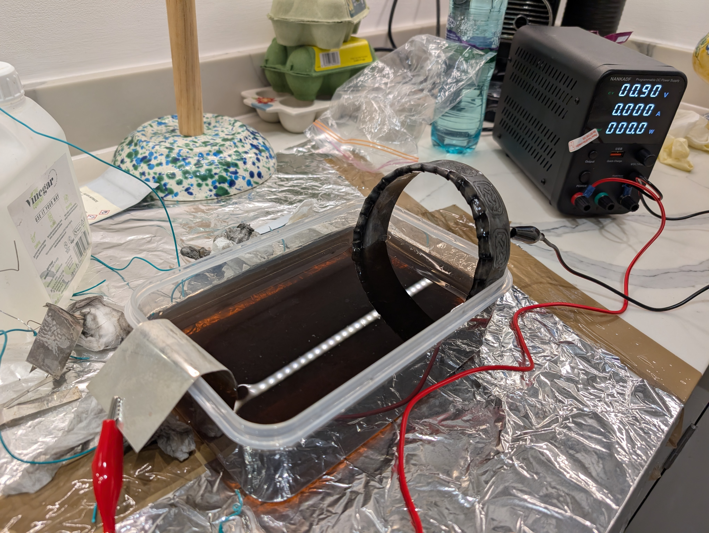

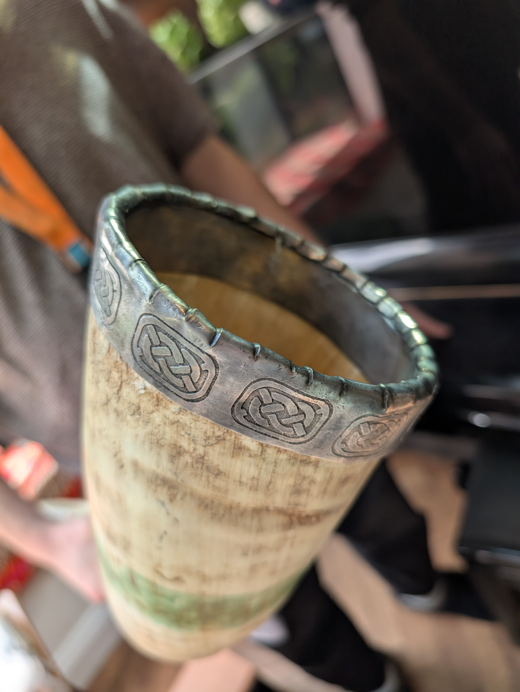

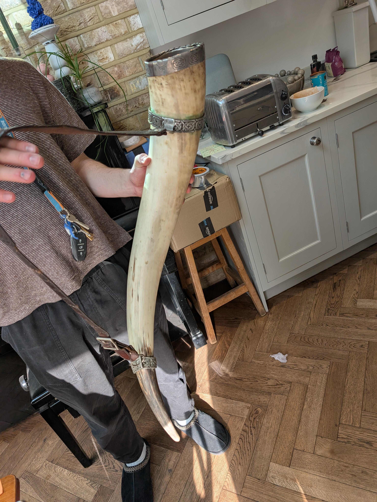

---

## Martin at brasscare.uk

We found Martin online. He reconditions brass musical instruments and does professional silver plating to a very high standard. We sent him the cap with our thin DIY layer still on — he advised us not to strip it, as he would handle all prep as part of his process.

Turnaround was a couple of days. The result was genuinely shocking — mirror-bright, solid, and absolutely no battery taste. We recommend him without hesitation: **http://brasscare.uk/**

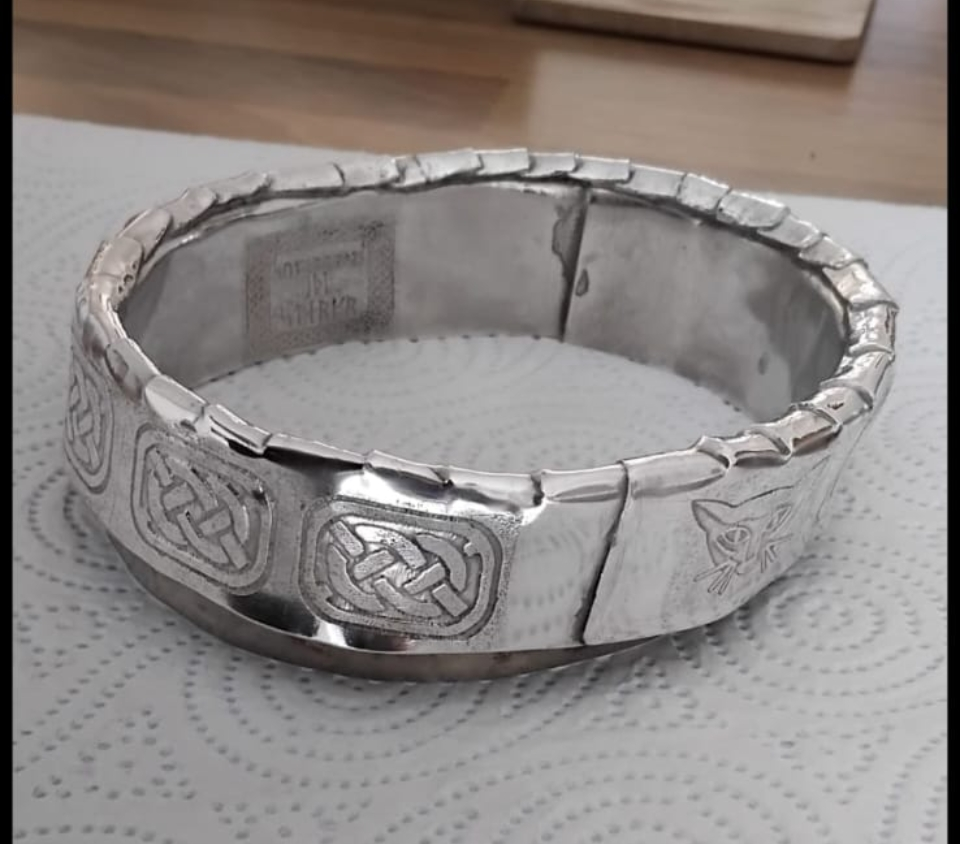

---

## The Finished Horn

All that remained was a trial fitting, minor adjustments to the ring spacing, and attaching the cap with flexible silicone bathroom sealant to seal any small gaps.

Our only regret is that we didn't also send the two original carrying rings to Martin. The new rim cap is so shiny that it makes the old rings look a bit shabby.

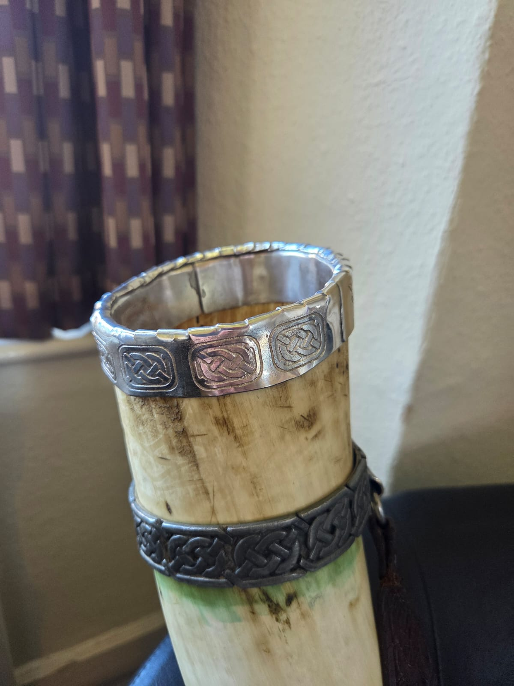

---

## Key Takeaways

The **50/50 acetone/water** tip is the one. That single piece of information would have saved us two days of misery. Pure acetone does not work. Dilute it.

Beyond that:
- **Anneal before you do anything** — it transforms how the copper handles
- **Use a heat gun instead of a gas torch for soldering** — less oxide, better control
- **Do the ferric chloride etching outside** — the staining is not a joke
- **For silver plating, pay a professional** — DIY silver plating on copper is genuinely not worth the effort for anything that touches your mouth

Have fun.

*John*

